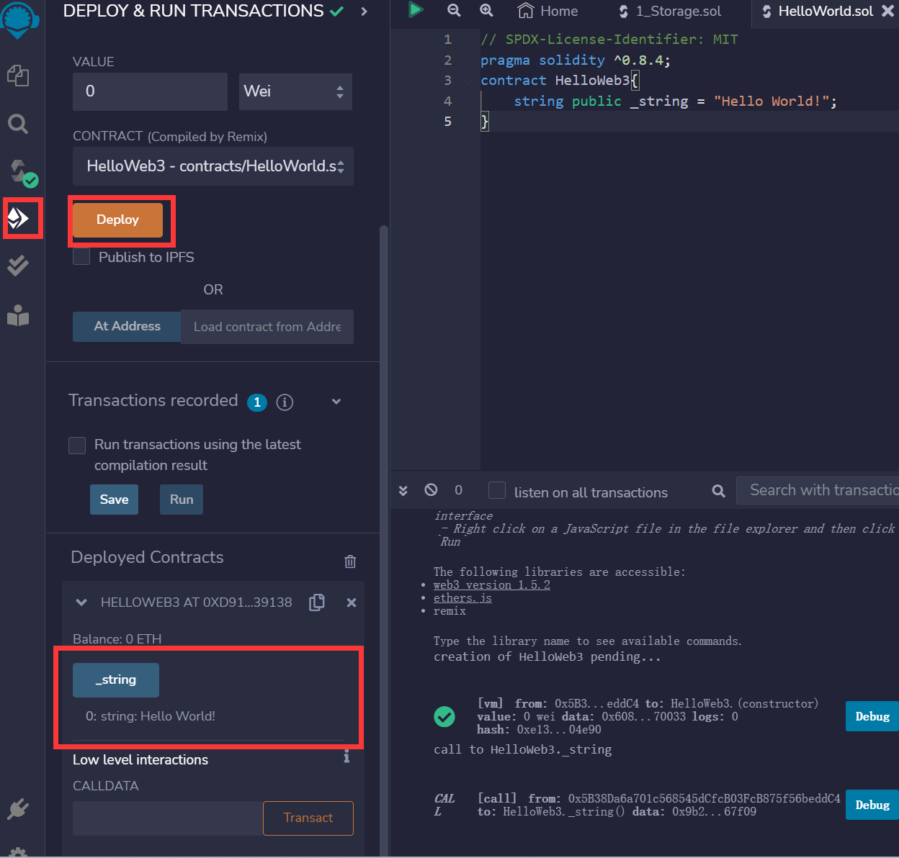
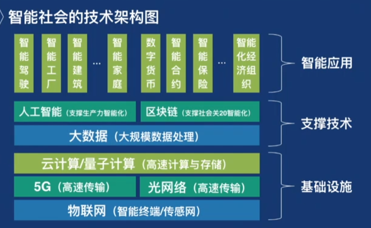
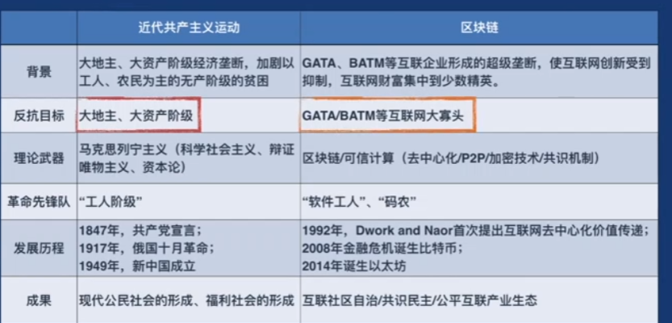
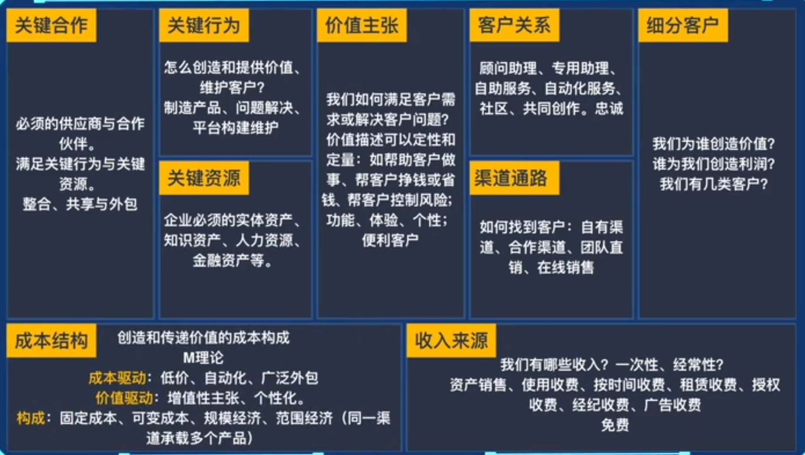
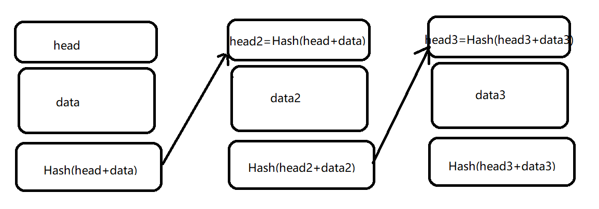

# web3探究

## 前言

为什么要学习web3？

因为我认为这是一个具有广阔前景的技术。基于区块链，数据安全堪比银行，除此之外还带来了更多的可能性——据此，我认为国内就算是没法完整地应用它，也能产生相当大的价值。而且，我也相信精英们的眼光，他们相信区块链一定有他们的道理，我所扮演的角色并非领路人，但是也能抢在一众人前面。

总结就是，接受新事物，拥抱先进技术。

[TOC]

## 概念

**本章节内容参考资料**：[以太坊官网](https://ethereum.org/)

### 什么是去中心化

> **Transactions directly connect sender and recipient** without having to deal with any central authority. Nobody else will have access to your funds and **nobody can tell you what services you can use**. This is possible because of the blockchain technology upon which cryptocurrencies operate.

举个例子就是交易没有第三方，是两者直接交易的。而区块链就是一种去中心化的实现形式。

### 什么是区块链

> **A blockchain is a database of transactions** that is updated and shared across many computers in a network. Every time a new set of transactions is added, its called a “block” - hence the name blockchain. Most blockchains are public, and you **can only add data, not remove**. If someone wanted to alter any of the information or cheat the system, they’d need to do so on the majority of computers on the network. That is a lot! This makes established blockchains like Ethereum **highly secure**.
>
> Blockchains use cryptographic techniques to ensure that your funds are safe. Similar techniques have been used in the banking industries to ensure the security of monetary transactions for years. So you could say cryptocurrencies have a bank level of security.

总结一下就是：**一种通过网络共享的数据库，只能增加数据而不能删除。每一条数据都叫一个区块。数据非常安全。**

之所以安全，是因为要篡改这个区块链的某个数据的话，需要在该数据库所在网络上的每一个计算机上篡改数据，这就使得篡改数据的成本异常巨大——据说银行也是采用了类似的方式来保证数据的安全性，所以可以说区块链有银行级别的安全性。

### 什么是加密货币

> Crypto (short for cryptocurrency) is **a new form of digital money** powered by cryptography.

就是基于密码学的数字货币，非常安全且去中心化（不被第三方干预）。

比特币（bitcoin）是区块链1.0时代的标志，创建于2008年，是最早的去中心化数字货币。

以太坊（ethereum）是区块链2.0的标志，创建于2015年，是在比特币的基础上进行了创新，增加了可编程性，这意味着可以基于以太坊开发去中心化的应用程序，这种应用程序即decentralized application，简称DAPP。

至于区块链3.0，还存在争议，暂不讨论。

### DAPP如何工作

DAPP要与一条区块链产生关联，其服务端就需要成为区块链上的一个节点，把区块链当作数据库，利用这些数据提供服务。把这个节点加入到区块链的过程就叫做“上链”。


节点之间通过RPC通信直接访问执行层，这层通常是一些开源社区维护的，可能由不同的语言实现。利用执行层提供的API，通过JWT完成身份认证访问共识层，共识层通过共识机制通知该链上其他节点，在其他节点一致认可后即完成上链。

### 开发前悉知

**本章节内容参考资料**：

[Truffle Suit官网](https://trufflesuite.com/docs/)

[solidity wiki](https://en.wikipedia.org/wiki/Solidity)

#### **solidity**

> Solidity is a [statically typed programming language](https://en.wikipedia.org/wiki/Statically_typed_programming_language) designed for developing smart contracts that run on the [Ethereum Virtual Machine](https://en.wikipedia.org/wiki/Ethereum#Virtual_machine) (EVM).
>
> Solidity uses ECMAScript-like syntax which makes it familiar for existing web developers;
>
> however unlike ECMAScript it has static typing and [variadic](https://en.wikipedia.org/wiki/Variadic) return types.

solidity是为了**智能合约（Contract）**开发而设计的语言，智能合约可以类比OOP中Class这么一个概念，并且它需要**以太坊虚拟机（EVM）**作为自己的运行环境。

而且前端开发者易于上手solidity，因为它和ES语法很像，只不过是静态类型+明确函数返回类型的。当作TS和Java写就行了。

#### **Ganache**

> Ganache is **a personal blockchain** for rapid Ethereum and Corda distributed application development.
>
> Ganache comes in two flavors: a UI and CLI

可以类比postman，是一个区块链本地开发辅助工具，原理就是开一个本地的临时区块链用于开发。会提供**应用程序二进制接口**，即**ABI（Application Binary Interface）**，给应用程序调用。

这些ABI通常以JSON文件的形式存在。

> ABI和API的区别是什么？
>
> API是两个软件间通信的接口。
>
> ABI则是更为底层，定义了软件如何与OS内核交互、如何与自身交互等。这样是区块链节点间使用RPC通信的体现。

#### **Truffle**

> A world class development environment, testing framework and asset pipeline for blockchains using the Ethereum Virtual Machine (EVM)

一个区块链开发框架，使用以太坊虚拟机，语言是solidity。

#### **Pinata**

就是一个免费的静态资源托管，懒得写后端做数据持久化，就上传到这里存着。

至于为什么这里写一点关于它的介绍呢，是因为觉得拥抱一点新工具或许可以拓宽视野吧，也算是避免在舒适圈太久。

#### **IERC和ERC**

IERC是**Interface Ethereum Request for Comment（以太坊意见征求 的 接口）**ERC的接口，规定了ERC需要实现的函数和事件。

ERC是**Ethereum Request for Comment**，是IERC的具体实现，可以看作是以太坊应用开发的标准，实现了一些基本的函数和事件。

> 直接类比C/C++中.h文件与.c/.cpp文件的关系就行了

所以需要[IERC].sol和[ERC].sol两个文件才能实现一个合约。

#### **Remix**

由以太坊官方开发的，一个专用于solidity智能合约开发的IDE，特点是在web端。

使得调试、部署智能合约变得更简单。

> 推荐使用VSCode编写，然后远程连接Remix进行后续操作

#### MetaMask

浏览器上的虚拟币钱包

#### **gas**

类似于手续费，进行区块链相关操作时，需要消耗一定的gas才能进行，具体数值为gas单价 * gas总量。

> 好像还是没说点上到底怎么算的——这个其实我暂时也没弄懂，初步推测和程序的空间开销有一定关系，后面再研究一下。

#### Etherscan

一个区块链浏览器，能够更好地帮助我们使用以太坊。

比如，我们可以通过某次交易的hash值来查询到这次交易的信息，以及更方面地汇款等等。

## Solidity基础

**本章节内容参考资料: [WTF Solidity](https://github.com/AmazingAng/WTF-Solidity)**

还是要学一下基本语法，据说能读懂代码的话，能避免很多亏钱项目（虽然不知道为什么，但是还是先学一下吧，没有坏处）

### HelloWorld

```solidity
// SPDX-License-Identifier: MIT
pragma solidity ^0.8.4;
contract HelloWeb3{
    string public _string = "Hello Web3!";
}
```

第一行注释是指明开源协议，不写能运行但是会有警告。

第二行是指定solidity版本，可以是一个区间，不同版本的语法可能存在差别。

第三行，contract即合约，可以类比为class。


然后在Remix的这个位置点deploy就行了，成功后下方会出现_string，点击一下就能看到我们的HelloWorld了



### 数据类型

变量类型这里主要介绍一些特殊的，其他简要提一下就好：

| 类型                                  | 简介                                                         |
| ------------------------------------- | ------------------------------------------------------------ |
| bool、string、int、uint uint256、enum | 通识，不再赘述                                               |
| address                               | 20个字节，一个以太坊地址；<br />**可以被payable关键字修饰，变为可转账地址** |
| bytes                                 | 分为两类：定长（byte、bytes8、bytes32），为基本数据类型<br />不定长（byte1），为引用数据类型<br />（其实就是字面意思） |
|                                       |                                                              |


注意变量声明要带上修饰符，像这样：

```solidity
bytes32 public a = "hhhhhhhh";
// 不满32位会在末尾补0
```

变量修饰符如下：

| 修饰符名称                | 简介                                 |
| ------------------------- | ------------------------------------ |
| public、private、internal | 参考下文函数修饰符部分               |
| storage                   | 永久存储在链上，消耗gas多            |
| memory                    | 存在在内存，不上链，消耗gas少        |
| calldata                  | 和memory类似，但是修饰的变量不能修改 |
|                           |                                      |


至于数组和结构体，像C语言一样就行了。

### 函数

solidity的函数比较特殊，先看看完整结构怎么写：

```solidity
// 反正就是稀里哗啦一堆修饰符
function <function name>(<parameter types>) {internal|external|public|private} [pure|view|payable] [returns (<return types>)]

// 来看个实例清爽一点
function numPlus(int num) external pure returns(int newNum, bool) {
	newNum += 1;
	return(newNum, false);
}
```

> **internal|external|public|private**
>
> - `public`: 完全公开。
> - `private`: 仅限内部访问。
> - `external`: 仅限外部访问（但可以用`this.f()`来调用，`f`是函数名）。
> - `internal`: 相当于protected，内部和继承的可访问。
>
> tips: 除了external之外，其他三个都可以用于修饰变量，其中public还会为变量自动生成同名的getter
>
> **[pure|view|payable]**
>
> - `payable` 修饰的函数可以向合约转入ETH
> - `pure`不能读写区块链上的状态
> - `view` 只可读取链上状态
> - `什么都不写` 即default，可以读也可以写

返回值需要提前声明，可以指定名称也可以不指定（感觉非常神奇），对于函数返回多个值的情况可以使用解构赋值：

```solidity
int num;
int[3] arr;
(num, arr) = func();
```

### 事件

> 即event，是EVM上日志的抽象，可以通过RPC接口来订阅监听这些事件

声明一个事件：

```solidity
event Eve(address indexed from, address indexed to, uint256 value);
```

`indexed`是事件特有的一个关键字，被其修饰的变量会被保存到EVM的日志中。

**释放**一个事件——即**触发**这个事件（不要误解为销毁这个事件）。

关键字是**emit**。

```solidity
function eve (
	address from,
	address to,
	uint256 value
) external {
	emit Eve(from, to, value);
}
```

## 开发DAPP

## 深入区块链

区块链到底能干什么？

让我们再回过头来审视一下区块链。始终记住，技术只是手段，思维和视野才是真正决定我们未来的东西。

### 区块链的未来价值

#### 会是泡沫吗

> 不是机器人，不是大数据，甚至不是人工智能，而是区块链将引发人类第四次工业革命，并重新定义互联网甚至人类社会。

区块链会是一个泡沫吗？让我们向历史要答案。

90年代HTTP协议推广，互联网在国内刚刚兴起，但此时也不过是少数人的高级玩具罢了，很少有人能看清未来的发展局势，就连第一批互联网的创业者，很多也都在受挫之后决然离开。

但是很显然，互联网并不是泡沫。互联网的发展符合了时代对于更高效生产力的需求，自然而然地发展壮大。

那么，区块链是泡沫吗？

有2025发展工业4.0的目标，我想未来就必定不会缺少区块链的一席之地：



最后的答案就是，我选择相信时代的潮流和精英们的眼光，这将是互联网的一场反垄断的共产主义运动。

#### 解决了什么问题

概括来说就是**可信**和**公平**，使得信任模式从 **熟人信任** 和 **中介信任** 发展为 **去中介陌生信任（区块链信任）**，为每一个人都提供了面对陌生数据也能检测其真伪地能力。

这可以用于个人信息证明、社会舆论、历史信息记录、知识产权纠纷溯源、众筹商业模式等等一系列社会问题。

只要有”是否可信“的问题存在，就有区块链的应用场景，并且区块链也是一个分布式共享数据库，基于这一点它也可以用于传统的应用并且可以极大提高攻击者的攻击成本。

> 需要注意，区块链上的数据是不可篡改的，但是这并不意味着记录的数据就是真实的



未来，要更好地应用区块链，还要想办法解决以下问题：



### 区块链底层技术

#### 技术架构

不同的区块链技术架构可能有所删改，但大体是如下的：

| 层结构名称 | 对应的实例                | 作用                                   |
| ---------- | ------------------------- | -------------------------------------- |
| 应用层     | 钱包、交易市场、DAPP等    | 各个能够被应用的部分                   |
| 合约层     | EVM、Solidity、智能合约等 | 使得区块链能够作为一个可编程的底层技术 |
| 激励层     | 挖矿、Gas                 | 激励人们参与提供算力                   |
| 共识层     | POW、POS                  | 确保数据一致性                         |
| 网络层     | P2P                       | 节点间数据通信                         |
| 数据层     | 区块与区块链              | 记录数据                               |
|            |                           |                                        |

> 比如比特币没有合约层，联盟链没有激励层

#### 基本原理



其实就和报文加密那一套一样的，但是玩了一手套娃。

比如，如果篡改了data2，那么摘要部分就发送改变了，就找不到下一个区块了。这就保证了，当第n个区块加入到链中时，第n-1个区块就不可被更改，可递推地：**第n个区块加入到链中时，之前的所有区块都不能被更改。**

硬要更改的话，就只能从第一个开始更改之后所有的区块数据。

#### 共识机制

主要解决两个问题：

> **重复花费**
>
> 比如我有5个大饼，承诺给A转5个，同时又承诺给B转5个，如果区块链分布式数据不同步，那么这种骚操作就有可能成功。
>
> **自私挖矿**
>
> 正常的流程时，每一轮只能挖出一个区块，挖到这个块的矿工会发布这个块，这样就把这个区块加入到了区块链上，所有人都会得到这份数据。
>
> 然而，要是矿工把这个区块藏起来不发布，然后基于这个块继续挖新的块，暗中形成一个分支，等到自己的分支长度超越了当前的主链长度时再发布，由于区块链会把最长的一个分支当作主分支，就会抛弃原本的主链，使得之前主链全部作废，其他人的努力成果毁于一旦。
